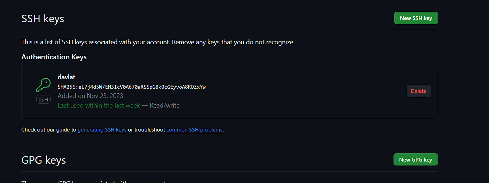
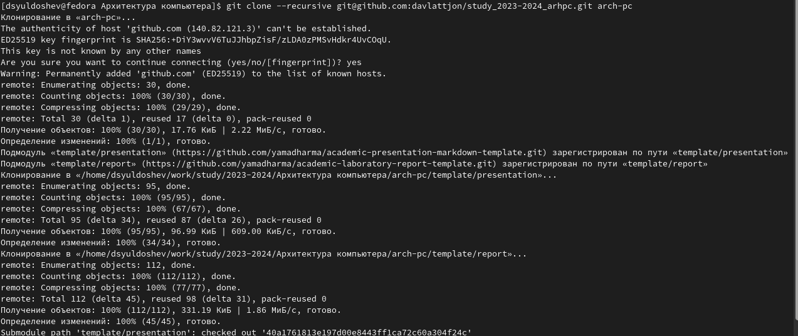
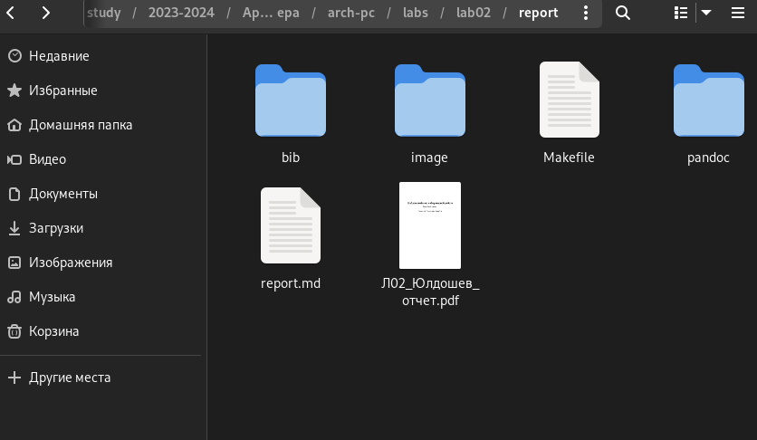
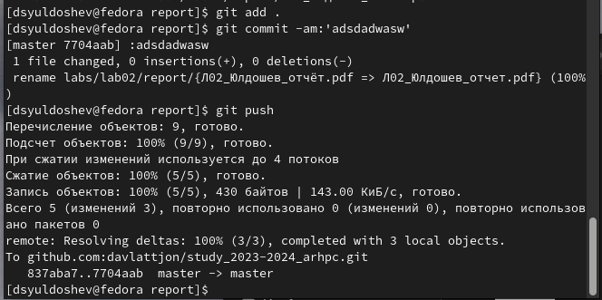

---
## Front matter
title: "Шаблон отчёта по лабораторной работе 2"
subtitle: "Простейший вариант"
author: Юлдошев Давлатджон Шухратович"

## Generic otions
lang: ru-RU
toc-title: "Содержание"

## Bibliography
bibliography: bib/cite.bib
csl: pandoc/csl/gost-r-7-0-5-2008-numeric.csl

## Pdf output format
toc: true # Table of contents
toc-depth: 2
lof: true # List of figures
lot: true # List of tables
fontsize: 12pt
linestretch: 1.5
papersize: a4
documentclass: scrreprt
## I18n polyglossia
polyglossia-lang:
  name: russian
  options:
	- spelling=modern
	- babelshorthands=true
polyglossia-otherlangs:
  name: english
## I18n babel
babel-lang: russian
babel-otherlangs: english
## Fonts
mainfont: PT Serif
romanfont: PT Serif
sansfont: PT Sans
monofont: PT Mono
mainfontoptions: Ligatures=TeX
romanfontoptions: Ligatures=TeX
sansfontoptions: Ligatures=TeX,Scale=MatchLowercase
monofontoptions: Scale=MatchLowercase,Scale=0.9
## Biblatex
biblatex: true
biblio-style: "gost-numeric"
biblatexoptions:
  - parentracker=true
  - backend=biber
  - hyperref=auto
  - language=auto
  - autolang=other*
  - citestyle=gost-numeric
## Pandoc-crossref LaTeX customization
figureTitle: "Рис."
tableTitle: "Таблица"
listingTitle: "Листинг"
lofTitle: "Список иллюстраций"
lotTitle: "Список таблиц"
lolTitle: "Листинги"
## Misc options
indent: true
header-includes:
  - \usepackage{indentfirst}
  - \usepackage{float} # keep figures where there are in the text
  - \floatplacement{figure}{H} # keep figures where there are in the text
---

# Цель работы

Ознакомиться с принципами работы средств контроля версий. Настроить git для начала работы. Используя git, создать рабочее пространство и репозиторий курса, после чего загрузить файлы на github.

# Выполнение лабораторной работы

### 1. Настройка github

 Создали учётную запись на сайте github  и Указали имя и e-mail владельца репозитория

 {#fig:001 width=700}

### 2

•	Настроили utf-8 в выводе сообщений git
•	Задали имя “мастер” для начальной ветки.
•	Настроили параметры autocrlf и safecrlf

{#fig:001 width=700}

### 3

Сгенерировали пару ключей (приватный и открытый)

{#fig:001 width=700}

### 5

Создали  SSH-ключ на сайте github.

{#fig:001 width=700}

### 6

Создали каталог для предмета «Архитектура компьютера»

{#fig:001 width=700}

### 7

Создали репозиторий курса на основе шаблона через web-интерфейс github.

{#fig:001 width=700}

### 8

Перешли  в новый каталог и удалили лишние файлы и создали необходимые каталоги.

{#fig:001 width=700}

### 10

Вводим нужные команды и отправляем файлы на сервер.

{#fig:001 width=700}

# Самостоятельная работа

### 1

Создаю отчет по выполнению лабораторной работы и вставляю соответствующий каталог  lab02.

{#fig:001 width=700}

### 2

Копирую предыдущий отчет по первой лабораторной работе в соответствующий ей каталог и Загружаю файлы на github

{#fig:001 width=700}

# Вывод

В этой лабораторной работе я ознакомился с принципами работы средств контроля версий, настроил git для начала работы на линуксе. Используя git, создал рабочее пространство и репозиторий курса, после чего научился загружать файлы на github.

::: {#refs}
:::
